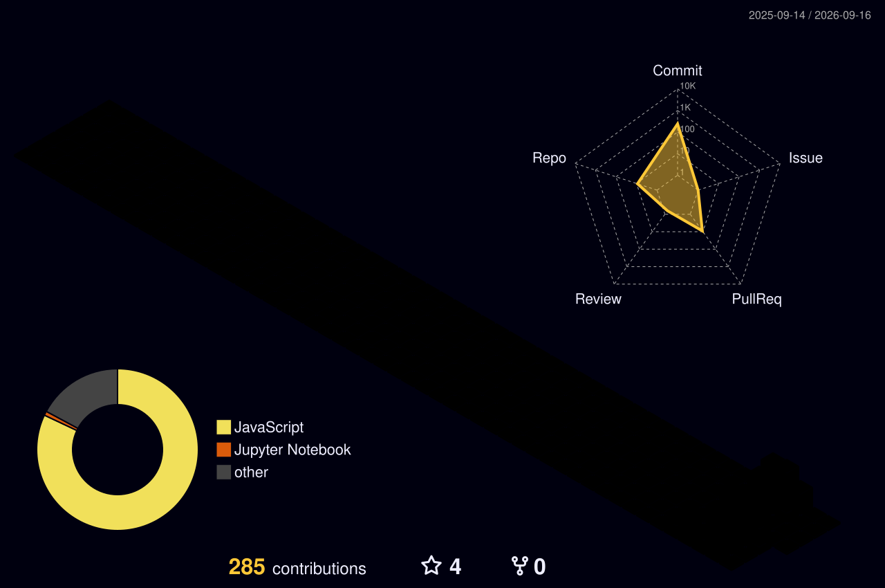

# 🌌 NIPUNI THEEKSHANA
### ⚙️ Intelligent Systems Developer · Data Science Practitioner · Full-Stack Engineer

---

<!-- GITHUB NATIVE BUTTONS (WILL NEVER BREAK) -->
<p align="center">
  <a href="https://linkedin.com" target="_blank"><b>🌐 [ LinkedIn Profile ]</b></a>
  &nbsp;&nbsp;·&nbsp;&nbsp;
  <a href="mailto:theenipuni55@gmail.com"><b>📧 [ Email Direct ]</b></a>
  &nbsp;&nbsp;·&nbsp;&nbsp;
  <b>📍 colombo, Sri Lanka</b>
</p>

---

## 🚀 Advanced Tech Stack & Tooling

> [!NOTE]
> ### 📊 Core System Processing Flow
> **`Data Engineering ──> Predictive Modeling (ML) ──> Robust API Endpoints ──> Reactive UX`**

*   **🧠 Data Science & AI:** `Python` · `R` · `Pandas` · `NumPy` · `Scikit-Learn` · `SHAP (XAI)` · `SciPy`
*   **🎨 Interfaces & Backend:** `JavaScript (ES6+)` · `React 18` · `Node.js` · `Express.js` · `Tailwind CSS`
*   **🌐 DevOps & Data:** `MongoDB` · `SQL Infrastructure` · `Git` · `GitHub Actions` · `Docker` · `AWS`

---

## ⚡ Executive Engineering Summary

I am a driven **Data Science Undergraduate (BSc Hons)** focused on bridging the gap between heavy statistics and production software engineering. Instead of isolating model building to local scripts, I design and orchestrate the full processing lifecycle: engineering state stores, configuring automated optimization setups, launching REST endpoints, and painting responsive frontend structures.

---

## 🏗️ Architectural Flow Matrix

```text
  ┌───────────────┐      ┌───────────────────────┐      ┌────────────────────┐      ┌──────────────┐
  │  [Raw Data]   │ ───> │ [Data Science Models] │ ───> │ [Secure API Layer] │ ───> │ [UX Context] │
  │ Pandas/Scikit │      │  SARIMA / CLV / SHAP  │      │ Node.js / Express  │      │ React / CSS  │
  └───────────────┘      └───────────────────────┘      └────────────────────┘      └──────────────┘
```

*   **Production Implementation:** Moving standalone algorithms out of research sandboxes into modular, decoupled service layers.
*   **Explainable Analytics (XAI):** Utilizing game-theoretic approaches (`SHAP`) to interpret machine logic, translating raw statistics into customer tier directives.
*   **Decoupled Engineering:** Orchestrating API routes that bind mathematical models back into live, state-retaining software applications.

---

## 💎 Selected Portfolio Deployments

> [!IMPORTANT]
> ### 1️⃣ StyleSense AI — Luxury Commerce Intelligence Platform
> A production-ready e-commerce suite bringing advanced machine learning architectures straight into the consumer lifecycle.
> *   **Generative Guidance:** Google Gemini integration powering an adaptive, conversational virtual concierge.
> *   **Statistical Operations:** Custom `SARIMA` pipeline for real-time demand modeling and `K-Means Clustering` for customer profiling.
> *   **Computer Vision Framework:** Advanced feature vector similarity computations maps visual characteristics directly to active items.
> *   🔗 **Repository Access:** [Explore StyleSense AI Architecture](https://github.com)

> [!TIP]
> ### 2️⃣ Customer Churn — Explainable Predictive Engine
> An end-to-end telemetry system optimized to flag user attrition patterns while maintaining deep model transparency metrics.
> *   **Operational Thresholding:** Shifted categorization bounds to `0.30` to guarantee a high **74.87% recall**, lowering costly false negative predictions.
> *   **High-Fidelity Interpretability:** Integrated `SHAP` values into standard coefficients, ensuring all business risk targets are completely explainable.
> *   **Strategic Segmentation:** Developed an automatic action routing matrix mapping high-risk profiles directly to protective retention initiatives.
> *   🔗 **Repository Access:** [Examine Churn Prediction Pipeline](https://github.com)

---

<div align="center">
  <sub>Built with architectural precision and 100% native GitHub blocks. © 2026 Nipuni Theekshana</sub>
</div>
<picture>
  <source media="(prefers-color-scheme: dark)" srcset="./profile-3d-contrib/profile-night-rainbow.svg">
  <source media="(prefers-color-scheme: light)" srcset="./profile-3d-contrib/profile-green-animate.svg">
  
</picture>
